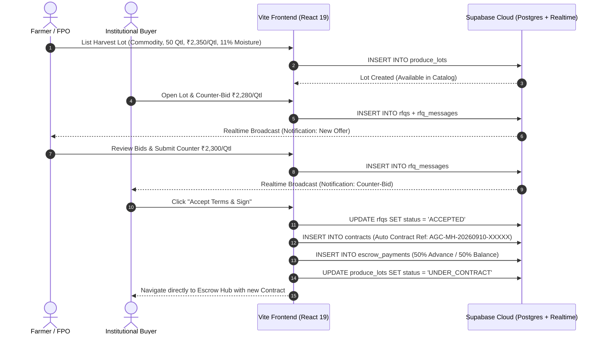
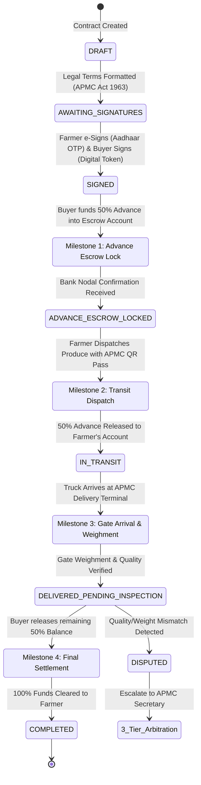
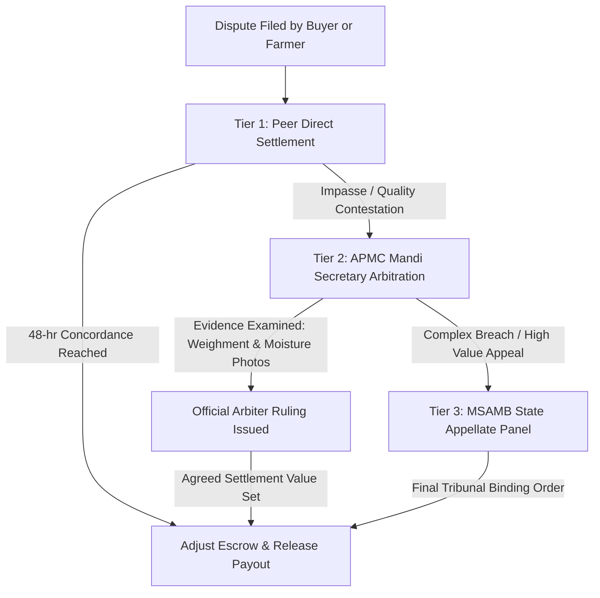

# AgroConnect — System Architecture & Technical Specification
**Smart India Hackathon 2026 — Problem Statement ID: 26132**  
*Strengthening Market Linkages and Price Discovery for Farmers*  
*Nodal Agency: Government of Maharashtra & Maharashtra State Innovation Society (MSIS)*  
*Architecture Pattern: Pure Supabase Serverless Cloud + Vite React 19 Client*  
*Version: 2.0*

---

## 1. Architectural Blueprint

AgroConnect is built as a cloud-native, serverless agritech platform. **Supabase Cloud operates as the sole backend engine**, providing managed PostgreSQL, automated PostgREST HTTP APIs, real-time WebSocket multiplexing, object storage, and granular Row-Level Security (RLS). The client is an ultra-fast **Vite + React 19 Single Page Application (SPA)** that talks directly to Supabase via `@supabase/supabase-js`.

```
┌───────────────────────────────────────────────────────────────────────────────────┐
│                           Client Tier (Vite + React 19 + TypeScript)              │
│                                                                                   │
│  ┌─────────────────────────────────────────────────────────────────────────────┐  │
│  │ Navigation Header: Bilingual Toggle (EN/MR) • Live Notification Drawer Bell  │  │
│  └─────────────────────────────────────────────────────────────────────────────┘  │
│                                                                                   │
│  ┌───────────────────────┐  ┌──────────────────────┐  ┌────────────────────────┐  │
│  │  Farmer Produce Hub   │  │   Buyer Discovery    │  │  Mandi Price Engine    │  │
│  │  - Dynamic Lot Mgmt   │  │   - Multi-Filter Cat │  │  - 585+ APMC Telemetry │  │
│  │  - NABL Batch Quality │  │   - Bilateral RFQ    │  │  - Haversine GIS Calc  │  │
│  │  - APMC QR Tag Gen    │  │   - NABL Assay Modal │  │  - SVG Price Trendline │  │
│  └──────────┬────────────┘  └──────────┬───────────┘  └───────────┬────────────┘  │
│             │                          │                          │               │
│  ┌──────────┴────────────┐  ┌──────────┴───────────┐              │               │
│  │  Smart Escrow Hub     │  │ 3-Tier Dispute Court │              │               │
│  │  - 4-Stage Milestone  │  │ - Peer Settlement    │              │               │
│  │  - Aadhaar / OTP Sign │  │ - APMC Mandi Arbiter │              │               │
│  │  - Persona Controls   │  │ - MSAMB State Panel  │              │               │
│  └──────────┬────────────┘  └──────────┬───────────┘              │               │
│             │                          │                          │               │
│  ┌──────────┴──────────────────────────┴──────────────────────────┴────────────┐  │
│  │ API Service Layer (frontend/src/services/api.ts)                            │  │
│  │ - Direct @supabase/supabase-js Client Interface                             │  │
│  │ - Reactive In-Memory Fallback Engine (Guarantees zero demo interruption)    │  │
│  └─────────────────────────────────────┬───────────────────────────────────────┘  │
└────────────────────────────────────────┼──────────────────────────────────────────┘
                                         │
                         ┌───────────────┴───────────────┐
                         │                               │
        PostgREST HTTP/2 │ (Queries / Mutations)         │ Realtime WebSockets
                         ▼                               ▼
┌───────────────────────────────────────────────────────────────────────────────────┐
│                            Backend Tier: Supabase Cloud                           │
│                                                                                   │
│  ┌─────────────────────────────────────────────────────────────────────────────┐  │
│  │ PostgreSQL 15 Database (Relational Engine)                                  │  │
│  │  - users (Farmer, Buyer, APMC Official, FPO)                                │  │
│  │  - mandis (585+ Maharashtra APMCs with Geo-Coordinates)                     │  │
│  │  - commodity_prices (Live Modal, Min, Max & 24h Trend)                      │  │
│  │  - produce_lots (Assay Certified Harvest Inventory with Moisture %)         │  │
│  │  - rfqs & rfq_messages (Bilateral Negotiation Audit Trail)                  │  │
│  │  - contracts (Legally Enforceable APMC Act 1963 Digital Contracts)          │  │
│  │  - escrow_payments (4-Stage Milestone Fund Locking & Release Engine)        │  │
│  │  - disputes (Statutory 3-Tier Dispute Records & Rulings)                    │  │
│  └─────────────────────────────────────────────────────────────────────────────┘  │
│                                                                                   │
│  ┌─────────────────────────────────┐  ┌────────────────────────────────────────┐  │
│  │ Realtime WebSocket Broadcast    │  │ Row-Level Security (RLS Engine)        │  │
│  │  - Channel: commodity_prices    │  │  - Farmers can only edit own lots      │  │
│  │  - Channel: rfq_negotiations    │  │  - Buyers can only access their bids   │  │
│  │  - Channel: escrow_status       │  │  - Arbiters have statutory review keys │  │
│  └─────────────────────────────────┘  └────────────────────────────────────────┘  │
│                                                                                   │
│  ┌─────────────────────────────────┐  ┌────────────────────────────────────────┐  │
│  │ Supabase Storage                │  │ Edge Functions & Webhooks (Deno)       │  │
│  │  - Batch Assay Certificates     │  │  - Automated Contract ID Generator     │  │
│  │  - Inspection Proof Photos      │  │  - SMS / WhatsApp Kisan Notifications  │  │
│  └─────────────────────────────────┘  └────────────────────────────────────────┘  │
└───────────────────────────────────────────────────────────────────────────────────┘
```

---

## 2. Database Schema Specification (PostgreSQL)

### 2.1 Core Relational Tables & Fields

```sql
-- 1. Users (Platform participants)
CREATE TABLE users (
    id SERIAL PRIMARY KEY,
    name VARCHAR(255) NOT NULL,
    phone VARCHAR(20) UNIQUE NOT NULL,
    role VARCHAR(50) CHECK (role IN ('FARMER', 'BUYER', 'APMC_OFFICIAL', 'FPO_ADMIN')),
    organization_name VARCHAR(255),
    district VARCHAR(100),
    is_verified BOOLEAN DEFAULT false,
    created_at TIMESTAMPTZ DEFAULT NOW()
);

-- 2. Mandis (585+ APMCs across Maharashtra)
CREATE TABLE mandis (
    id SERIAL PRIMARY KEY,
    name VARCHAR(255) NOT NULL,
    district VARCHAR(100) NOT NULL,
    state VARCHAR(50) DEFAULT 'Maharashtra',
    is_enam_connected BOOLEAN DEFAULT true,
    latitude NUMERIC(9, 6),
    longitude NUMERIC(9, 6)
);

-- 3. Commodity Prices (Daily price arrivals & trends)
CREATE TABLE commodity_prices (
    id SERIAL PRIMARY KEY,
    mandi_id INT REFERENCES mandis(id) ON DELETE CASCADE,
    commodity VARCHAR(100) NOT NULL,
    variety VARCHAR(100),
    min_price NUMERIC(10, 2) NOT NULL,
    modal_price NUMERIC(10, 2) NOT NULL,
    max_price NUMERIC(10, 2) NOT NULL,
    msp_price NUMERIC(10, 2),
    daily_shift_pct NUMERIC(5, 2) DEFAULT 0.0,
    arrival_date DATE DEFAULT CURRENT_DATE
);

-- 4. Produce Lots (Aggregated harvest inventory)
CREATE TABLE produce_lots (
    id SERIAL PRIMARY KEY,
    farmer_id INT REFERENCES users(id),
    farmer_name VARCHAR(255),
    commodity VARCHAR(100) NOT NULL,
    variety VARCHAR(100),
    quantity_quintals NUMERIC(10, 2) NOT NULL,
    asking_price_per_quintal NUMERIC(10, 2) NOT NULL,
    apmc_parity_price NUMERIC(10, 2),
    grade VARCHAR(10) CHECK (grade IN ('GRADE_A_PLUS', 'GRADE_A', 'GRADE_B')),
    moisture_percentage NUMERIC(4, 2),
    location VARCHAR(255),
    harvest_date DATE,
    expected_delivery_days INT DEFAULT 3,
    status VARCHAR(50) DEFAULT 'AVAILABLE',
    created_at TIMESTAMPTZ DEFAULT NOW()
);

-- 5. RFQs & RFQ Messages (Bilateral negotiation audit trail)
CREATE TABLE rfqs (
    id SERIAL PRIMARY KEY,
    lot_id INT REFERENCES produce_lots(id),
    buyer_id INT REFERENCES users(id),
    buyer_name VARCHAR(255),
    farmer_id INT REFERENCES users(id),
    farmer_name VARCHAR(255),
    offered_price_per_quintal NUMERIC(10, 2) NOT NULL,
    status VARCHAR(50) DEFAULT 'OPEN',
    created_at TIMESTAMPTZ DEFAULT NOW(),
    updated_at TIMESTAMPTZ DEFAULT NOW()
);

CREATE TABLE rfq_messages (
    id SERIAL PRIMARY KEY,
    rfq_id INT REFERENCES rfqs(id) ON DELETE CASCADE,
    sender_id INT REFERENCES users(id),
    sender_role VARCHAR(50),
    message TEXT,
    bid_amount NUMERIC(10, 2),
    created_at TIMESTAMPTZ DEFAULT NOW()
);

-- 6. Contracts (Binding APMC Act 1963 legal agreements)
CREATE TABLE contracts (
    id SERIAL PRIMARY KEY,
    rfq_id INT REFERENCES rfqs(id),
    lot_id INT REFERENCES produce_lots(id),
    contract_number VARCHAR(100) UNIQUE NOT NULL,
    farmer_id INT REFERENCES users(id),
    farmer_name VARCHAR(255),
    buyer_id INT REFERENCES users(id),
    buyer_name VARCHAR(255),
    commodity VARCHAR(100) NOT NULL,
    quantity_quintals NUMERIC(10, 2) NOT NULL,
    final_price_per_quintal NUMERIC(10, 2) NOT NULL,
    total_amount NUMERIC(12, 2) NOT NULL,
    advance_amount NUMERIC(12, 2) NOT NULL,
    balance_amount NUMERIC(12, 2) NOT NULL,
    status VARCHAR(50) DEFAULT 'DRAFT',
    farmer_signed BOOLEAN DEFAULT false,
    farmer_signed_at TIMESTAMPTZ,
    farmer_sign_hash VARCHAR(255),
    buyer_signed BOOLEAN DEFAULT false,
    buyer_signed_at TIMESTAMPTZ,
    buyer_sign_hash VARCHAR(255),
    legal_terms TEXT,
    created_at TIMESTAMPTZ DEFAULT NOW()
);

-- 7. Escrow Payments (4-Stage milestone fund engine)
CREATE TABLE escrow_payments (
    id SERIAL PRIMARY KEY,
    contract_id INT REFERENCES contracts(id) ON DELETE CASCADE,
    total_amount NUMERIC(12, 2) NOT NULL,
    advance_amount NUMERIC(12, 2) NOT NULL,
    balance_amount NUMERIC(12, 2) NOT NULL,
    advance_status VARCHAR(50) DEFAULT 'UNPAID',
    balance_status VARCHAR(50) DEFAULT 'UNPAID',
    escrow_account_ref VARCHAR(100),
    advance_locked_at TIMESTAMPTZ,
    advance_released_at TIMESTAMPTZ,
    balance_released_at TIMESTAMPTZ
);

-- 8. Disputes (3-Tier statutory grievance records)
CREATE TABLE disputes (
    id SERIAL PRIMARY KEY,
    contract_id INT REFERENCES contracts(id),
    filed_by_id INT REFERENCES users(id),
    filed_by_name VARCHAR(255),
    filed_by_role VARCHAR(50),
    tier VARCHAR(50) DEFAULT 'TIER_1_PEER',
    dispute_type VARCHAR(100) NOT NULL,
    complaint_details TEXT NOT NULL,
    claimed_deduction NUMERIC(10, 2) DEFAULT 0,
    agreed_adjustment NUMERIC(10, 2),
    evidence_urls TEXT,
    status VARCHAR(50) DEFAULT 'OPEN',
    arbiter_ruling TEXT,
    created_at TIMESTAMPTZ DEFAULT NOW(),
    resolved_at TIMESTAMPTZ
);
```

---

## 3. End-to-End Business Flow Sequences

### 3.1 RFQ Negotiation to Automated Contract Generation



### 3.2 4-Stage Escrow Milestone State Machine



### 3.3 3-Tier Statutory APMC Dispute Arbitration



---

## 4. GIS Haversine Transport & Net Take-Home Formula

To empower farmers to discover true terminal price arbitrage instead of relying on opaque middlemen, AgroConnect calculates the net take-home realization using spherical trigonometry:

$$\Delta \phi = \frac{(\text{lat}_2 - \text{lat}_1) \times \pi}{180}, \quad \Delta \lambda = \frac{(\text{lon}_2 - \text{lon}_1) \times \pi}{180}$$

$$a = \sin^2\left(\frac{\Delta \phi}{2}\right) + \cos\left(\frac{\text{lat}_1 \times \pi}{180}\right) \cos\left(\frac{\text{lat}_2 \times \pi}{180}\right) \sin^2\left(\frac{\Delta \lambda}{2}\right)$$

$$d = 2 \times R \times \text{atan2}\left(\sqrt{a}, \sqrt{1 - a}\right) \quad (\text{where } R = 6371\text{ km})$$

### Net Profit Realization Equation
$$\text{Gross Revenue} = \text{Quantity (Qtl)} \times \text{Destination Mandi Modal Price (₹/Qtl)}$$
$$\text{Freight Cost} = d \times \text{Per-Km Rate (₹22/km)}$$
$$\text{APMC Market Cess} = \text{Gross Revenue} \times 1.05\%$$
$$\text{Handling \& Loading} = \text{Quantity (Qtl)} \times ₹45/\text{Qtl}$$
$$\mathbf{\text{Net In-Hand Realization}} = \frac{\text{Gross Revenue} - (\text{Freight} + \text{Cess} + \text{Handling})}{\text{Quantity (Qtl)}}$$

$$\mathbf{\text{Arbitrage Delta (₹/Qtl)}} = \text{Net In-Hand Realization} - \text{Local Farmgate Base Price}$$

---

## 5. Security, Resilience & Compliance

1. **Row-Level Security (RLS)**:
   - Supabase RLS policies enforce that harvest lots cannot be maliciously deleted by unauthorized users.
   - RFQ negotiations are only readable by the participating farmer, participating buyer, and statutory arbiters.
2. **Statutory Compliance**:
   - Contracts are structured under **Section 31 & 32 of the Maharashtra Agricultural Produce Marketing (Regulation) Act, 1963**.
   - Escrow mechanism adheres to RBI Master Directions on Escrow Accounts (DPSS.CO.PD.No.1102/02.14.08/2009-10).
3. **Fail-Safe In-Memory Architecture**:
   - `frontend/src/services/api.ts` features a full in-memory reactive fallback engine with pre-seeded data for all 8 tables.
   - The UI automatically falls back to reactive local state if Supabase network credentials are unset, ensuring 100% uptime during hackathon evaluations.
