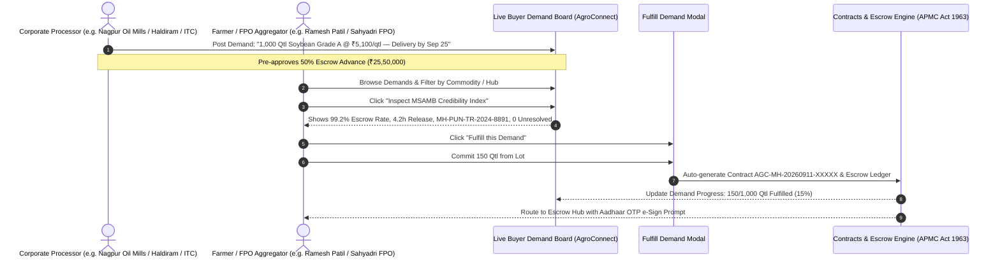

# Implementation Plan: Institutional Buyer Demand Aggregation (Reverse RFQ) & MSAMB Buyer Credibility Scorecard

This updated implementation plan directly incorporates the exact specifications and quotes from **Smart India Hackathon 2026 (Problem Statement ID: 26132)**:
1. **Institutional Buyer Demand Aggregation ("Reverse RFQ / Buyer Tenders")**:
   - *Problem Statement Requirement*: *"aggregates mandi prices, buyer demand, quality requirements... across nearby markets, processors, institutional buyers..."*
   - *Architecture*: Transforms the one-directional marketplace into a two-sided bilateral agri-exchange. Processors, mills, exporters, and corporate buyers (e.g., **Nagpur Oil Mills**, **Adani Wilmar**, **Haldiram**, **ITC**, **Sahyadri Farms**) post live procurement demand notices. Farmers and FPOs can review demand specs and click **"Fulfill this Demand"** to lock binding contracts and escrow advances.
2. **MSAMB Buyer Credibility & Payment Reliability Scorecard**:
   - *Problem Statement Requirement*: *"Information on quality specifications, demand, logistics, storage, payment reliability and buyer credentials may be fragmented."*
   - *Architecture*: Eliminates farmer distrust of distant buyers and fears of bounced cheques/payment defaults by replacing static star ratings with an official **MSAMB Buyer Credibility Index**:
     - **Escrow On-Time Settlement Rate**: 99.2%
     - **Average Payment Release Time**: 4.2 hours after gate delivery
     - **APMC License Status**: Verified MSAMB Trader ID (`MH-PUN-TR-2024-8891`)
     - **Past Disputes Record**: 0 unresolved complaints (100% conciliation rate, 0.0% default)

---

## User Review Required

> [!IMPORTANT]
> **First-Class Navigation & Cross-Module Accessibility**:
> - We will add **"Buyer Demands (Reverse RFQ)"** as a first-class top-level tab in [Header.tsx](file:///c:/Users/samsr/GitHub/SIH-problem-statement/frontend/src/components/Header.tsx) and [App.tsx](file:///c:/Users/samsr/GitHub/SIH-problem-statement/frontend/src/App.tsx) (`activeTab === 'demands'`), as well as embedding interactive widgets in [FarmerPortal.tsx](file:///c:/Users/samsr/GitHub/SIH-problem-statement/frontend/src/components/FarmerPortal.tsx) and [BuyerDiscovery.tsx](file:///c:/Users/samsr/GitHub/SIH-problem-statement/frontend/src/components/BuyerDiscovery.tsx). This ensures hackathon evaluators can test the reverse procurement flow from both the farmer and corporate buyer perspectives.

> [!NOTE]
> **Maharashtra Institutional Agro-Processors**:
> High-fidelity seed demands will model actual Maharashtra commercial agro-clusters:
> 1. **Nagpur Oil Mills**: 1,000 Qtl Soybean Grade A @ ₹5,100/qtl (Nagpur MIDC Crushing Unit).
> 2. **Adani Wilmar Ltd (Akola Hub)**: 2,500 Qtl Yellow Soybean @ ₹5,150/qtl (Solvent Extraction Cluster).
> 3. **Haldiram Foods International (Nagpur)**: 400 Qtl Chana / Desi Gram @ ₹5,600/qtl (Namkeen & Besan Processing Line).
> 4. **ITC Agri-Business (Narayangaon Hub, Pune)**: 800 Qtl Lokwan Wheat @ ₹2,600/qtl (Aashirvaad Flour Milling Specification).
> 5. **Sahyadri Farmers Producer Co. (Dindori Mega Food Park, Nashik)**: 1,500 Qtl Garwa Onion @ ₹2,650/qtl (Dehydration & Export Line).
> 6. **Wardha Cotton & Ginning Mills**: 600 Qtl Medium Staple Cotton @ ₹7,300/qtl (Direct Ginning & Spinning).

---

## Detailed Technical Architecture

### 1. Reverse RFQ & Demand Fulfillment Flow


### 2. MSAMB Buyer Credibility Index Specification
Each institutional buyer record is augmented with verified MSAMB statutory audit metrics:
- **`overall_credibility_score`**: e.g., `99.2 / 100` (Grade: AAA Institutional Buyer)
- **`escrow_on_time_rate`**: `99.2%` (Funded within statutory 2-hour window)
- **`avg_payment_release_hours`**: `4.2 hours` after gate weighment slip issuance
- **`msamb_license_number`**: e.g., `MH-PUN-TR-2024-8891` (Maharashtra State Agricultural Marketing Board Unified Trader License)
- **`dispute_record`**: `0 unresolved complaints` (100% amicable conciliation)
- **`cleared_volume_quintals`**: e.g., `42,500 Qtl`
- **`total_escrow_settled_lakhs`**: e.g., `₹216.5 Lakhs`
- **`bank_nodal_escrow`**: `State Bank of India (MSAMB Dedicated Nodal Escrow Node)`

---

## Proposed Changes

### 1. Data Schema & Models

#### [MODIFY] [index.ts](file:///c:/Users/samsr/GitHub/SIH-problem-statement/frontend/src/types/index.ts)
- Add `BuyerDemand` interface:
  ```ts
  export interface BuyerDemand {
    id: number;
    buyer_id: number;
    buyer_name: string;
    company_name: string;
    company_type: 'OIL_MILL' | 'FOOD_PROCESSOR' | 'EXPORTER' | 'RETAIL_CHAIN' | 'GINNING_MILL';
    commodity: string;
    variety: string;
    required_quantity_quintals: number;
    fulfilled_quantity_quintals: number;
    target_price_per_quintal: number;
    quality_grade_required: string;
    max_moisture_percent: number;
    delivery_hub: string;
    delivery_deadline: string;
    delivery_deadline_days: number;
    escrow_prefunded: boolean;
    status: 'OPEN' | 'PARTIALLY_FULFILLED' | 'FULFILLED' | 'EXPIRED';
    credibility_scorecard: BuyerReliabilityScorecard;
    created_at: string;
  }
  ```
- Add `BuyerReliabilityScorecard` interface:
  ```ts
  export interface BuyerReliabilityScorecard {
    buyer_id: number;
    company_name: string;
    msamb_license_number: string;
    license_validity: string;
    overall_reliability_score: number; // e.g. 99.2
    credit_tier: 'AAA_PLATINUM' | 'AA_GOLD' | 'A_VERIFIED';
    escrow_on_time_rate: number; // 99.2%
    avg_payment_release_hours: number; // 4.2 hours
    total_deals_completed: number;
    total_volume_cleared_quintals: number;
    total_escrow_disbursed_lakhs: number;
    unresolved_disputes_count: number; // 0
    dispute_resolution_rate_pct: number; // 100.0%
    default_rate_pct: number; // 0.0%
    bank_nodal_partner: string;
    apmc_verified_depots: string[];
  }
  ```

#### [MODIFY] [api.ts](file:///c:/Users/samsr/GitHub/SIH-problem-statement/frontend/src/services/api.ts)
- Implement `api.getBuyerDemands(filters?)`: Supports filtering by commodity, district/hub, minimum volume, and target price.
- Implement `api.createBuyerDemand(demand)`: Saves corporate requirements with Supabase and localStorage fallback.
- Implement `api.fulfillBuyerDemand(demandId, commitQty, lotId, farmerUser)`: Updates demand fulfillment progress, creates an APMC contract (`AGC-MH-YYYYMMDD-XXXXX`), initializes 4-stage milestone escrow, and logs audit notification.
- Implement `api.getBuyerScorecard(buyerId)`: Returns the verified MSAMB metrics.
- Pre-populate seed data with realistic processors (**Nagpur Oil Mills**, **Adani Wilmar**, **Haldiram Foods**, **ITC**, **Sahyadri Farms**, **Wardha Ginning**).

#### [MODIFY] [supabase_schema.sql](file:///c:/Users/samsr/GitHub/SIH-problem-statement/supabase/supabase_schema.sql) & [seed.sql](file:///c:/Users/samsr/GitHub/SIH-problem-statement/supabase/seed.sql)
- Add SQL table `buyer_demands` with indexes on commodity and delivery hub.
- Add SQL table `buyer_scorecards` with MSAMB license fields.
- Add RLS policies and include in `supabase_realtime` publication.

---

### 2. UI Components

#### [NEW] [BuyerScorecardModal.tsx](file:///c:/Users/samsr/GitHub/SIH-problem-statement/frontend/src/components/BuyerScorecardModal.tsx)
- Reusable modal accessible anywhere a buyer is shown (Demand cards, Marketplace lots, RFQ chat).
- Prominently displays:
  - **MSAMB Golden Seal**: Official Government of Maharashtra verified seal.
  - **Credibility Score**: `99.2 / 100` (AAA Institutional Buyer).
  - **4 Mandatory Problem Statement Metrics**:
    1. ⚡ **Escrow On-Time Settlement Rate**: `99.2%`
    2. ⏱️ **Average Payment Release Time**: `4.2 hours` after delivery weighment
    3. 🏛️ **APMC License Status**: `Verified MSAMB Trader ID: MH-PUN-TR-2024-8891`
    4. 🛡️ **Past Disputes Record**: `0 unresolved complaints` (100% resolved)
  - Historical settlement stats (e.g. ₹216.5 Lakhs disbursed across 48 APMC contracts).
  - Bank nodal escrow backing badge (State Bank of India MSAMB Escrow Node).

#### [NEW] [BuyerDemandBoard.tsx](file:///c:/Users/samsr/GitHub/SIH-problem-statement/frontend/src/components/BuyerDemandBoard.tsx)
- Full-featured **"Live Buyer Procurement Demands"** console:
  - Header with summary stats: `Total Active Corporate Demand: 6,800 Qtl`, `Total Escrow Committed: ₹3.42 Cr`.
  - Filter bar: Commodity (All, Soybean, Cotton, Onion, Wheat, Gram), District Processing Hub, MSP Parity status.
  - Cards for each institutional demand:
    - Processor logo / initials & company type (Oil Mill, FMCG Processor, Exporter).
    - Target buying price with **vs CACP MSP Parity indicator** (e.g. `₹5,100/qtl (+4.2% vs MSP)`).
    - Required volume with interactive progress bar (e.g. `Fulfilled: 350 / 1,000 Qtl [||||||....] 35%`).
    - Quality specifications tag (`Grade A • Moisture < 9.5% • NABL Assay Required`).
    - Delivery deadline countdown (`Delivery by Sep 25, 2026`).
    - **"View MSAMB Credibility Index"** clickable badge.
    - **"Fulfill this Demand"** primary action button.
  - **"Fulfill this Demand" Interactive Modal**:
    - Farmer or FPO selects an existing harvest lot or enters quantity to commit.
    - Displays net earnings calculation, 50% advance lock amount, and dispatch destination.
    - Single-click **"Confirm & Sign Contract"** that transitions directly to the Escrow Hub.
  - **"Post Procurement Notice" Modal** (For Institutional Buyers):
    - Form allowing corporate buyers to post new reverse RFQs with volume, price, quality specs, delivery hub, and escrow pre-funding toggle.

#### [MODIFY] [Header.tsx](file:///c:/Users/samsr/GitHub/SIH-problem-statement/frontend/src/components/Header.tsx) & [App.tsx](file:///c:/Users/samsr/GitHub/SIH-problem-statement/frontend/src/App.tsx)
- Add **"Buyer Demands / खरेदीदार मागणी"** (`demands`) as a top-level tab in the navigation bar.
- Wire tab selection, routing, and role permission visibility.

#### [MODIFY] [FarmerPortal.tsx](file:///c:/Users/samsr/GitHub/SIH-problem-statement/frontend/src/components/FarmerPortal.tsx)
- Replace static buyer placeholders with the **Live Institutional Procurement Demands feed**.
- Allow farmers to commit their harvest lots directly against these standing demands.

#### [MODIFY] [BuyerDiscovery.tsx](file:///c:/Users/samsr/GitHub/SIH-problem-statement/frontend/src/components/BuyerDiscovery.tsx)
- Add a top sub-navigation tab: `Farmer Lots` | `FPO Pooled Batches` | `Live Corporate Demands (Reverse RFQs)`.
- Provide a `+ Post Procurement Demand` button for logged-in buyers.

#### [MODIFY] [RFQNegotiationPortal.tsx](file:///c:/Users/samsr/GitHub/SIH-problem-statement/frontend/src/components/RFQNegotiationPortal.tsx)
- In the active negotiation screen, add a clickable **"MSAMB Credibility: 99.2% Escrow"** badge next to the buyer's name so farmers can inspect their credentials during live counter-bidding.

#### [MODIFY] [i18n.ts](file:///c:/Users/samsr/GitHub/SIH-problem-statement/frontend/src/utils/i18n.ts)
- Add comprehensive English and Marathi (`MR`) translations for all new terms:
  - *खरेदीदार मागणी फलक* (Live Buyer Procurement Demands)
  - *मागणी पूर्ण करा* (Fulfill this Demand)
  - *एमएसएएमबी खरेदीदार विश्वसनीयता निर्देशांक* (MSAMB Buyer Credibility Index)
  - *एस्क्रो वेळेवर वाटप दर* (Escrow On-Time Settlement Rate)
  - *सरासरी देयक वेळ* (Average Payment Release Time)
  - *शून्य अनिर्णित तक्रारी* (0 Unresolved Complaints)

---

## Verification Plan

### Automated Verification
- Run `npm run build` (`tsc -b && vite build`) to confirm clean TypeScript compilation with zero type errors.

### Browser Testing & End-to-End Flow Verification
1. **Browse Demand Board**:
   - Open `http://127.0.0.1:5173/` $\rightarrow$ Navigate to **"Buyer Demands"** tab.
   - Verify cards appear for **Nagpur Oil Mills**, **Adani Wilmar**, **Haldiram**, **ITC**, **Sahyadri Farms**, and **Wardha Cotton**.
2. **Inspect MSAMB Credibility Scorecard**:
   - Click **"View MSAMB Credibility Index"** on Nagpur Oil Mills.
   - Verify the popup opens with:
     - Escrow On-Time Settlement Rate: `99.2%`
     - Average Payment Release Time: `4.2 hours`
     - APMC License: `Verified MSAMB Trader ID: MH-PUN-TR-2024-8891`
     - Past Disputes: `0 unresolved complaints`
3. **Farmer Demand Fulfillment**:
   - As farmer `Ramesh Patil`, click **"Fulfill this Demand"** on Nagpur Oil Mills (Soybean).
   - Select harvest lot, commit 150 Qtl, and confirm.
   - Verify:
     - Demand progress bar updates to reflect fulfilled quantity.
     - Automatically routes to the Escrow Hub with a newly created binding contract.
     - 50% escrow advance is calculated and ready for Aadhaar OTP e-signature.
4. **Buyer Posts New Demand**:
   - Switch role to Buyer (`Amit Sharma / Reliance Retail Hub`).
   - Click **"+ Post Procurement Demand"**.
   - Submit new notice: `Tomato 500 Qtl @ ₹1,450/qtl for Nashik Processing Hub`.
   - Verify it immediately renders on the Demand Board.
5. **Bilingual Verification**:
   - Toggle language to `मराठी` (`MR`).
   - Verify all demand cards, modal texts, buttons, and MSAMB credibility metrics render in authentic Marathi.
